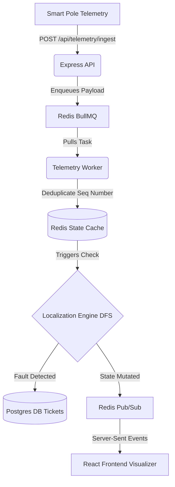

# Architecture

## Data Flow Diagram

## Data Sourcing and Ingestion
Telemetry payloads arrive via the POST `/api/telemetry/ingest` endpoint. To absorb massive thundering herds during a grid crash without dropping packets or stalling the Node event loop, the Express route validates the payload strictly via Zod and immediately offloads it to a **BullMQ** queue backed by Redis, returning a rapid `202 Accepted`.

**Deduplication & Clock Skew:** UDP/TCP payloads can arrive out-of-order. The background worker tracks the `seq` integer per device in Redis (`device:seq:${device_id}`). If a message arrives with an older sequence, it is dropped silently, ensuring state remains strictly chronological regardless of network lag.

## Storage and Internal Model
Our relational schema (Drizzle ORM over PostgreSQL) models the topological hierarchy from `substations` -> `feeders` -> `dts` -> `poles`.
- **Topological Representation**: Poles contain a nullable `parentPoleId`. We enforce a strict Directed Acyclic Graph (DAG) representing electrical flow.
- **Why Relational over GraphDB?**: While Neo4j excels at graph queries, PostgreSQL with Recursive CTEs (or in-memory application DFS) is more than sufficient for radial trees of this size. Furthermore, relational modeling allowed us to strictly type geographic data (Lat/Lon) and hardware metadata without the overhead of maintaining a separate GraphDB cluster.

## The Localization Algorithm
The localization engine runs continuously as telemetry hits the Redis state cache.
1. **The Traversal**: We execute a Depth-First Search (DFS) starting from the root Distribution Transformer (DT) down its associated poles.
2. **The Boundary**: The algorithmic trigger is finding a strictly defined topological edge where `Pole A` is `live` (energized) and its direct child `Pole B` is `dark` (de-energized). This precise edge is mathematically isolated as the fault location (Span Fault).
3. **Simultaneous Faults**: Because DFS explores every branch independently, it can identify multiple disconnected faults on entirely separate radial branches simultaneously without collapsing them into a single incident.
4. **Missing Ordering (60% Missing Parents)**: For poles lacking explicit `parentPoleId` relationships, we built an inference engine (`topology.ts`) using a modified Minimum Spanning Tree (Prim's) heuristic. We calculate a Haversine distance matrix and attach orphans to the closest surveyed pole.
5. **Confidence Scoring**: If an isolated fault boundary occurs over an inferred edge, the incident's confidence score drops from 100% to 80%. If the boundary is inferred and multiple equidistant parent candidates existed, it drops further to 50%.
6. **Complexity**: O(V + E) for the DFS traversal where V is the poles under a single DT.

## Noise Handling
- **Dead Sensors**: A single sensor dying (`unknown` state) does not trigger a fault. A fault is strictly triggered by a `power_lost` event cascading down a branch.
- **Scheduled Outages**: Scheduled outages would be flagged at the DT level in Postgres, preventing the localization engine from traversing that sub-tree and emitting false tickets.
- **Debouncing**: Transients (flickers) are natively absorbed because state evaluation occurs only on finalized sequence numbers in the Redis hash.

## API Surface

| Method | Path | Purpose | Request Body |
|--------|------|---------|--------------|
| `POST` | `/api/telemetry/ingest` | Ingests hardware telemetry | `{ device_id, seq, timestamp, event, energized }` |
| `GET`  | `/api/stream/state` | Persistent SSE connection for UI | N/A |
| `GET`  | `/api/grid/state` | Returns full spatial graph and DTs | N/A |
| `POST` | `/api/simulate/fault` | Injects synthetic test faults | `{ type, targetId, dtId }` |
| `POST` | `/api/simulate/repair` | Re-energizes a localized fault | `{ faultId }` |

## UI Reasoning
The operator's screen prioritizes **spatial awareness** over tabular data.
- **The Visualization**: Rendered completely in native SVG (no D3 or React Flow) via an Affine mathematical projection of Lat/Lon coordinates to screen pixels. 
- **Omissions**: We deliberately excluded massive tables of historical telemetry logs. Operators need to know *where* the fault is instantly, not sift through JSON payloads.
- **Expected Fragility**: The visual density. Rendering 1,200 nodes required us to shrink node radii to 1.5px and utilize subtle CSS glow filters to prevent the screen from becoming a cluttered, unreadable web of intersecting lines.

## The AI Feature
The system utilizes AI strictly for localized code generation and architectural scaffolding during development, not as a runtime feature. The mathematical rigor required for fault localization (DFS bounding) and spatial mapping (Affine transforms) cannot be outsourced to non-deterministic LLM output in a production power-grid context; it must be executed strictly by deterministic algorithms.
